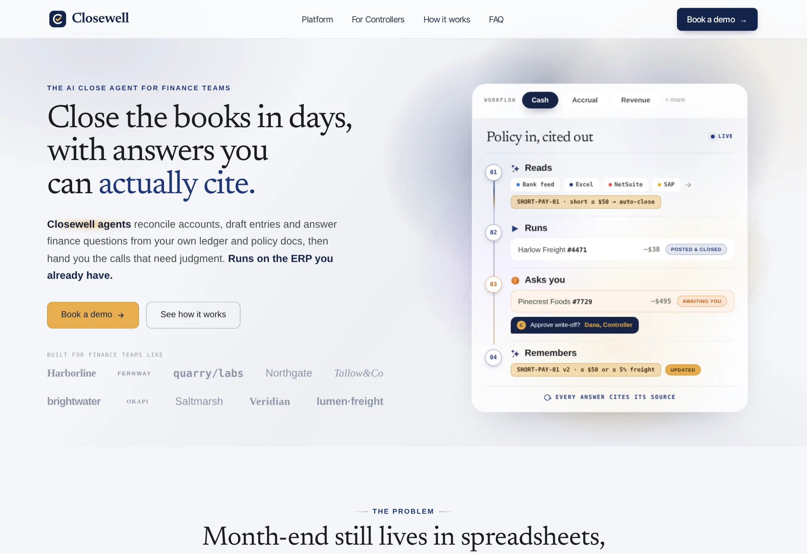

# Closewell

The AI close agent for finance teams: reconciliations, journal entries and ledger answers, grounded in your own books and cited every time.

**Live demo:** https://www.freelancerportfoliohub.com/jameslee/projects/closewell/index.html



## Overview

This repository holds the Closewell marketing site and the agent service behind its Ledger Q&A and close workflows. The site walks a finance team from "what is it" to "book a demo", with separate paths for CFOs and controllers. The product mockups (policy workflow card, close run, policy library, cited ledger answers) are rendered from typed data in HTML and inline SVG rather than screenshots, so copy and examples can change without design work.

The agent (`lib/agent`) answers only from the company's ledger and written policies. It retrieves policy sections, reads GL entries, matches bank lines to invoices and drafts journal entries for approval, then streams its answer with the entries and policy sections it relied on.

## Features

- **Four routes**: homepage, Platform, For Controllers and Book a demo, each section backed by typed content in `lib/data`
- **Interactive mockups**: rotating policy workflow (Cash / Accrual / Revenue), before/after close board with reviewer sign-off, six-tab capability explorer, four-step How it works walkthrough
- **Grounded close agent**: streaming `/api/agent` endpoint using the Anthropic SDK with a manual tool-use loop
  - `getLedgerEntries`, `matchTransactions`, `draftJournalEntry`, `citePolicy` tools with zod-validated inputs
  - Policy retrieval: section-aligned chunking, a pluggable embedding interface and cosine similarity search
  - Drafts never post; anything outside policy is routed to the named reviewer
- **Qualified demo requests**: `/api/demo-requests` validates the form, scores the lead by close length, ERP and role, and forwards it to a CRM webhook
- Accessible by default: native `<details>` FAQ, labelled form controls and radio chips, reduced-motion support, and pages that render fully without JavaScript

## Tech stack

| Area       | Choice                                                    |
| ---------- | --------------------------------------------------------- |
| Framework  | Next.js 15 (App Router), React 19                         |
| Language   | TypeScript (strict, `noUncheckedIndexedAccess`)           |
| Styling    | Hand-written CSS with design tokens, `next/font/local`    |
| AI         | `@anthropic-ai/sdk` (Claude Opus 5, adaptive thinking)    |
| Validation | zod (API bodies, tool inputs, environment)                |
| Tooling    | ESLint (flat config), Prettier, pnpm                      |

## Getting started

```bash
pnpm install
cp .env.example .env.local   # add ANTHROPIC_API_KEY to enable /api/agent
pnpm dev
```

Open http://localhost:3000.

### Environment variables

| Variable               | Required | Description                                              |
| ---------------------- | -------- | -------------------------------------------------------- |
| `ANTHROPIC_API_KEY`    | For the agent | API key used by `/api/agent`                        |
| `ANTHROPIC_MODEL`      | No       | Model id, defaults to `claude-opus-5`                    |
| `AGENT_MAX_TURNS`      | No       | Tool-use turns per request, defaults to `8`              |
| `DEMO_WEBHOOK_URL`     | No       | CRM webhook for demo requests; logged locally when unset |
| `NEXT_PUBLIC_SITE_URL` | No       | Canonical URL for metadata and the sitemap               |

### Calling the agent

```bash
curl -N http://localhost:3000/api/agent \
  -H 'content-type: application/json' \
  -d '{"messages":[{"role":"user","content":"Why did cloud infra rise in September?"}],"context":{"period":"2026-09"}}'
```

The response is newline-delimited JSON: `text` deltas, `tool_call` / `tool_result` activity, `citation` events and a final `done`. `lib/agent/stream.ts` includes a browser reader for the stream.

## Project structure

```
.
├── app/
│   ├── api/            # agent (streaming) and demo-requests route handlers
│   ├── controllers/    # For Controllers page
│   ├── get-started/    # Book a demo page
│   ├── platform/       # Platform page
│   ├── globals.css     # tokens, primitives, mockups, sections
│   ├── layout.tsx
│   └── page.tsx        # homepage
├── components/
│   ├── brand/          # logo mark
│   ├── capabilities/   # capability tabs and previews
│   ├── controller/     # For Controllers sections
│   ├── demo/           # demo intro and form
│   ├── home/           # hero workflow card, shift board, how it works…
│   ├── layout/         # header, footer, backdrop
│   ├── platform/       # Platform sections
│   ├── sections/       # shared sections (roles, security, FAQ, CTA)
│   └── ui/             # Button, Badge, Card, Avatar, Icon, Sparkline…
├── lib/
│   ├── agent/          # tools, retrieval, prompts, runner, ledger, policies
│   ├── data/           # typed page content
│   ├── services/       # demo-request qualification and delivery
│   └── validation/     # shared zod schemas
├── public/             # fonts and images
└── types/              # content and agent domain types
```

## Scripts

| Script           | Description                     |
| ---------------- | ------------------------------- |
| `pnpm dev`       | Start the dev server            |
| `pnpm build`     | Production build                |
| `pnpm start`     | Serve the production build      |
| `pnpm lint`      | ESLint                          |
| `pnpm typecheck` | TypeScript, no emit             |
| `pnpm format`    | Prettier                        |
